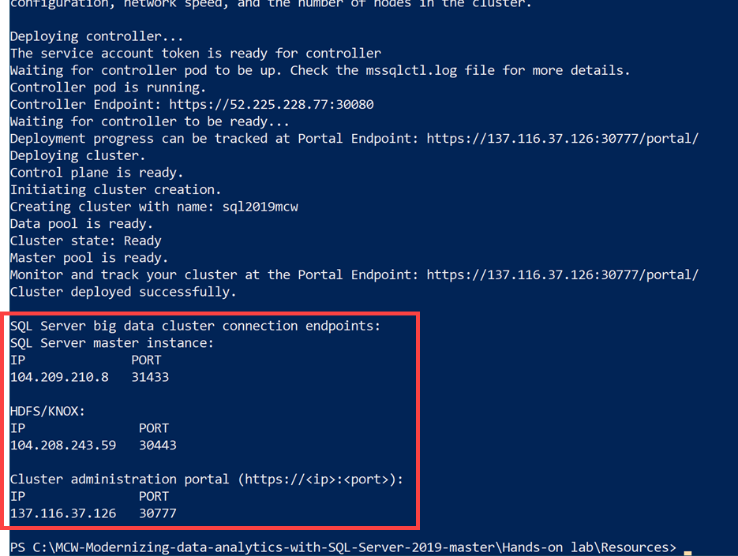

<div class="MCWHeader1">
Modernizing data analytics with SQL Server 2019
</div>

<div class="MCWHeader2">
Before the hands-on lab setup guide
</div>

<div class="MCWHeader3">
June 2019
</div>


Information in this document, including URL and other Internet Web site references, is subject to change without notice. Unless otherwise noted, the example companies, organizations, products, domain names, e-mail addresses, logos, people, places, and events depicted herein are fictitious, and no association with any real company, organization, product, domain name, e-mail address, logo, person, place or event is intended or should be inferred. Complying with all applicable copyright laws is the responsibility of the user. Without limiting the rights under copyright, no part of this document may be reproduced, stored in or introduced into a retrieval system, or transmitted in any form or by any means (electronic, mechanical, photocopying, recording, or otherwise), or for any purpose, without the express written permission of Microsoft Corporation.

Microsoft may have patents, patent applications, trademarks, copyrights, or other intellectual property rights covering subject matter in this document. Except as expressly provided in any written license agreement from Microsoft, the furnishing of this document does not give you any license to these patents, trademarks, copyrights, or other intellectual property.

The names of manufacturers, products, or URLs are provided for informational purposes only and Microsoft makes no representations and warranties, either expressed, implied, or statutory, regarding these manufacturers or the use of the products with any Microsoft technologies. The inclusion of a manufacturer or product does not imply endorsement of Microsoft of the manufacturer or product. Links may be provided to third party sites. Such sites are not under the control of Microsoft and Microsoft is not responsible for the contents of any linked site or any link contained in a linked site, or any changes or updates to such sites. Microsoft is not responsible for webcasting or any other form of transmission received from any linked site. Microsoft is providing these links to you only as a convenience, and the inclusion of any link does not imply endorsement of Microsoft of the site or the products contained therein.

© 2019 Microsoft Corporation. All rights reserved.

Microsoft and the trademarks listed at <https://www.microsoft.com/en-us/legal/intellectualproperty/Trademarks/Usage/General.aspx> are trademarks of the Microsoft group of companies. All other trademarks are property of their respective owners.

**Contents**

<!-- TOC -->

- [Modernizing data analytics with SQL Server 2019 before the hands-on lab setup guide](#Modernizing-data-analytics-with-SQL-Server-2019-before-the-hands-on-lab-setup-guide)
  - [Requirements](#Requirements)
  - [Regional limitations](#Regional-limitations)
  - [Before the hands-on lab](#Before-the-hands-on-lab)
    - [Task 1: Install software on your own VM or system](#Task-1-Install-software-on-your-own-VM-or-system)
    - [Task 2: Download lab files](#Task-2-Download-lab-files)
    - [Task 3: Install SQL Server 2019 Big Data clusters](#Task-3-Install-SQL-Server-2019-Big-Data-clusters)
    - [Task 4: Install sample databases and upload files](#Task-4-Install-sample-databases-and-upload-files)
    - [Task 5: Create sample Azure SQL Database](#Task-5-Create-sample-Azure-SQL-Database)

<!-- /TOC -->

# Modernizing data analytics with SQL Server 2019 before the hands-on lab setup guide

## Requirements

1. Microsoft Azure subscription must be pay-as-you-go or MSDN.
   - Trial subscriptions will not work.
2. PowerShell
3. Python3
4. curl
5. sqlcmd
7. [Azure CLI](https://docs.microsoft.com/cli/azure/install-azure-cli?view=azure-cli-latest)
8. [mssqlctl](https://docs.microsoft.com/en-us/sql/big-data-cluster/deploy-install-mssqlctl?view=sql-server-ver15)
9. [kubectl](https://kubernetes.io/docs/tasks/tools/install-kubectl/#install-with-powershell-from-psgallery)
10. [SQL Server Management Studio](https://go.microsoft.com/fwlink/?linkid=2078638) (SSMS) v18.0 or greater
11. [Azure Data Studio](https://docs.microsoft.com/sql/azure-data-studio/download?view=sql-server-ver15)
   - [SQL Server 2019 extension](sql-vnext-0.10.2-win-x64.vsix)

## Regional limitations

**L Series VMs** (required for SQL 2019 Big Data Clusters): East US 2, West US, West US 2, and a limited set of others worldwide

**Azure Machine Learning service**: East US, East US 2, West US 2, West Central US, South Central US, and a limited set of others worldwide

## Before the hands-on lab

Duration: 60 minutes

### Task 1: Install software on your own VM or system

The instructions that follow are the same for either your own system (desktop or laptop), or a Virtual Machine. It's best to have at least 4MB of RAM on the management system, and these instructions assume that you are not planning to run the database server or any Containers on the workstation. It's also assumed that you are using a current version of Windows, either desktop or server.

_(You can copy and paste all of the commands that follow in a PowerShell window that you run as the system Administrator)_

1. Ensure your system updates are current. Run from an Administrator-level PowerShell session (if running on a VM, you may safely ignore errors).

    ```powershell
    Set-ExecutionPolicy RemoteSigned

    Install-Module PSWindowsUpdate
    Import-Module PSWindowsUpdate
    Get-WindowsUpdate
    Install-WindowsUpdate
    ```

2. Install Chocolatey Windows package Manager.

    ```powershell
    Set-ExecutionPolicy Bypass -Scope Process -Force; iex ((New-Object System.Net.WebClient).DownloadString('https://chocolatey.org/install.ps1'))
    choco feature enable -n allowGlobalConfirmation
    ```

3. Install Azure CLI.

    ```powershell
    choco install azure-cli
    ```

4. Install Python 3.

    ```powershell
    choco install python3
    ```

5. Install git.

    ```powershell
    choco install git
    ```

6. Install kubectl.

    ```powershell
    choco install kubernetes-cli
    ```

7. Install Azure Data Studio.

    ```powershell
    choco install azure-data-studio
    ```

8. Install curl.

    ```powershell
    choco install curl
    ```

9. Install SQL command line tools (includes **sqlcmd**).

    ```powershell
    choco install sqlserver-cmdlineutils
    ```

9. Run the following commands separately in a new Command Prompt window.

    ```bash
    REM setx path "%path%;C:\Users\\AppData\Roaming\Python\Python37\Scripts"
    ```

    ```bash
    choco upgrade kubernetes-cli
    ```

    ```bash
    python -m pip install --upgrade pip
    ```

    ```bash
    pip3 install -r  https://private-repo.microsoft.com/python/ctp3.0/mssqlctl/requirements.txt
    ```

10. Install [SQL Server Management Studio](https://go.microsoft.com/fwlink/?linkid=2078638) (SSMS) v18.0 or greater.

11. Install the [SQL Server 2019 extension](sql-vnext-0.10.2-win-x64.vsix).

12. Download and install [sqlpackage](https://docs.microsoft.com/en-us/sql/tools/sqlpackage-download?view=sql-server-2017).

### Task 2: Download lab files

Download a starter project that includes a payment data generator that sends real-time payment data for processing by your lab solution, as well as data files used in the lab.

1. From your LabVM, download the starter files by downloading a .zip copy of the Cosmos DB real-time advanced analytics GitHub repo.

2. In a web browser, navigate to the [Cosmos DB real-time advanced analytics MCW repo](https://github.com/solliancenet/MCW-Modernizing-data-analytics-with-SQL-Server-2019). TODO: UPDATE URL

3. On the repo page, select **Clone or download**, then select **Download ZIP**.

   

4. Unzip the contents to your root hard drive (i.e. `C:\`). This will create a folder on your root drive named `MCW-Modernizing-data-analytics-with-SQL-Server-2019-master`.

### Task 3: Install SQL Server 2019 Big Data clusters

Open PowerShell and execute the following to deploy the clusters in preparation for the lab.

1. Before running the script, you must log in to your Azure account with Azure CLI at least once.

    ```bash
    az login
    ```

2. If you have multiple subscriptions, choose the appropriate subscription in which the resource should be billed. List all your subscriptions by entering the following into the shell:

   ```bash
   az account list
   ```

3. Select the specific subscription ID under your account using `az account set` command. Copy the `id` value from the output of the previous command for the subscription you wish to use into the `subscription id` placeholder:

   ```bash
   az account set --subscription <subscription id>
   ```

4. Navigate to the lab files folder.

    ```powershell
    cd "C:\MCW-Modernizing-data-analytics-with-SQL-Server-2019-master\Hands-on lab\Resources"
    ```

5. Use the following steps to run the deployment script. This script will create an AKS service in Azure and then deploy a SQL Server 2019 big data cluster to AKS. The [deploy-sql-big-data-aks.py](deploy-sql-big-data-aks.py) script located in this folder is customized with environment variables that set the memory allocation for the cluster.

    > **Please note:** this script can take up to 30 minutes to complete.

    ```bash
    python deploy-sql-big-data-aks.py
    ```

6. When prompted, enter the following information:

    | Value                     | Description                                                                                                                                                                                                      |
    | ------------------------- | ---------------------------------------------------------------------------------------------------------------------------------------------------------------------------------------------------------------- |
    | **Azure subscription ID** | The Azure subscription ID to use for AKS. You can list all of your subscriptions and their IDs by running `az account list` from another command line.                                                           |
    | **Azure resource group**  | The Azure resource group name to create for the AKS cluster. (suggest **hands-on-lab-sql2019**)                                                                                                                  |
    | **Docker username**       | The Docker username provided to you as part of the limited public preview.                                                                                                                                       |
    | **Docker password**       | The Docker password provided to you as part of the limited public preview.                                                                                                                                       |
    | **Azure region**          | The Azure region for the new AKS cluster (default **westus**).                                                                                                                                                   |
    | **Machine size**          | Set to **Standard_L8s**.                                                                                                                                                                                         |
    | **Worker nodes**          | Set the number of worker nodes in the AKS cluster to **3**.                                                                                                                                                      |
    | **Cluster name**          | Enter a **unique name**. This sets the name of both the AKS cluster and the big data cluster. The name of the cluster must be only lower case alpha-numeric characters, and no spaces. For example: "sql2019mcw" |
    | **Password**              | Password for the controller, HDFS/Spark gateway, and master instance (default **MySQLBigData2019**).                                                                                                             |
    | **Controller user**       | Username for the controller user (default: **admin**).                                                                                                                                                           |

    You can run the following at any time to get the status of the cluster:

    ```bash
    kubectl get all -n <your-cluster-name>
    ```

7. When the cluster is done deploying, you will see an output of the various IP addresses for the cluster. **Copy the SQL Server Master Instance, HDFS/KNOX, and cluster admin portal values** and save them to a text file that you can use for reference.

    Example:

    - SQL Server master instance:
      - IP
        - 104.209.210.8
      - PORT
        - 31433
    - HDFS/KNOX:
      - IP
        - 104.208.243.59
      - PORT
        - 30443
    - Cluster administration portal (`https://<ip>:<port>`):
      - IP
        - 137.116.37.126
      - PORT
        - 30777

    

### Task 4: Install sample databases and upload files

1. Open a new Windows command prompt (DO NOT user PowerShell for these steps).

2. Use **curl** to download the bootstrap script for the sample data.

    ```bash
    curl -o bootstrap-sample-db.cmd "https://raw.githubusercontent.com/Microsoft/sql-server-samples/master/samples/features/sql-big-data-cluster/bootstrap-sample-db.cmd"
    ```

3. Download the **bootstrap-sample-db.sql** Transact-SQL script. This script is called by the bootstrap script.

    ```bash
    curl -o bootstrap-sample-db.sql "https://raw.githubusercontent.com/Microsoft/sql-server-samples/master/samples/features/sql-big-data-cluster/bootstrap-sample-db.sql"
    ```

4. Run the bootstrap script. Substitute `<CLUSTER_NAMESPACE>`, `<SQL_MASTER_IP>`, `<SQL_MASTER_SA_PASSWORD>`, `<KNOX_IP>`, `<KNOX_PASSWORD>` with values output from the SQL Server 2019 cluster creation script above.

    ```bash
    .\bootstrap-sample-db.cmd <CLUSTER_NAMESPACE> <SQL_MASTER_IP> <SQL_MASTER_SA_PASSWORD> <KNOX_IP> <KNOX_PASSWORD>
    ```

    | Parameter                | Description                                                                |
    | ------------------------ | -------------------------------------------------------------------------- |
    | <CLUSTER_NAMESPACE>      | The name you gave your big data cluster (such as **sql2019mcw**).          |
    | <SQL_MASTER_IP>          | The IP address of your master instance.                                    |
    | <SQL_MASTER_SA_PASSWORD> | The SA password for the master instance (default is **MySQLBigData2019**). |
    | <KNOX_IP>                | The IP address of the HDFS/Spark Gateway.                                  |
    | <KNOX_PASSWORD>          | The same as your SA password.                                              |

    > Use kubectl to find the IP addresses for the SQL Server master instance and Knox. Run `kubectl get svc -n <your-big-data-cluster-name>` and look at the EXTERNAL-IP addresses for the master instance (**master-svc-external**) and Knox (**gateway-svc-external**).

### Task 5: Create sample Azure SQL Database

In this lab, you will be using an Azure SQL Database as a source for virtual tables within your SQL Server 2019 cluster. Follow these steps to create a new Azure SQL Server Database instance and configure its firewall.

1. Navigate to the [Azure portal](https://portal.azure.com).

2. Select **Create a resource**, type in "SQL Database" in the search field, then select **SQL Database** from the results.

    

3. Select **Create** in the SQL Database details page.

4. Within the **Basics** form, complete the following:

    - **Subscription**: Select your Azure subscription you are using for this lab.
    - **Resource group**: Select the resource group you are using for this lab.
    - **Database name**: Enter **WWI_Commerce**.
    - **Server**: Select **create new**.
      - **Server name**: Enter a unique server name.
      - **Server admin login**: Enter **ServerAdmin**.
      - **Password**: Enter **MySQLBigData2019**.
      - **Location**: Select the same location you are using for this lab. Should be the same as for your SQL Server 2019 Big Data clusters.
      - **Allow Azure services to access server**: Check this box.
    - **Want to use SQL elastic pool?**: Select No.
    - **Compute + storage**: Leave as default.

    

5. Select **Next: Additional settings >**.

6. Within the **Additional settings** form, select **Sample** next to **Use existing data**. Then select **Review + create**.

    

7. Within the **Review + create** form, select **Create**.

You should follow all steps provided *before* performing the Hands-on lab.
