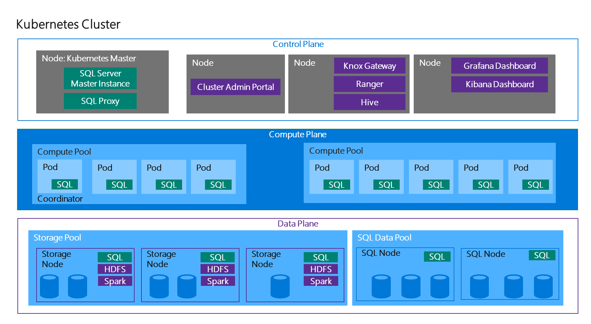
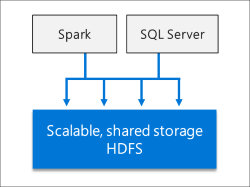
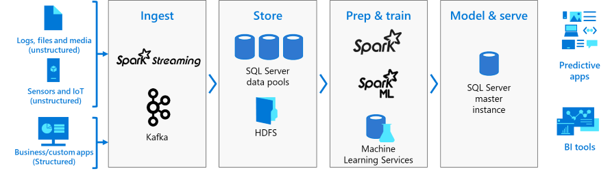

Modernizing data analytics with SQL Server 2019

Whiteboard design session trainer guide

June 2019

Information in this document, including URL and other Internet Web site references, is subject to change without notice. Unless otherwise noted, the example companies, organizations, products, domain names, e-mail addresses, logos, people, places, and events depicted herein are fictitious, and no association with any real company, organization, product, domain name, e-mail address, logo, person, place or event is intended or should be inferred. Complying with all applicable copyright laws is the responsibility of the user. Without limiting the rights under copyright, no part of this document may be reproduced, stored in or introduced into a retrieval system, or transmitted in any form or by any means (electronic, mechanical, photocopying, recording, or otherwise), or for any purpose, without the express written permission of Microsoft Corporation.

Microsoft may have patents, patent applications, trademarks, copyrights, or other intellectual property rights covering subject matter in this document. Except as expressly provided in any written license agreement from Microsoft, the furnishing of this document does not give you any license to these patents, trademarks, copyrights, or other intellectual property.

The names of manufacturers, products, or URLs are provided for informational purposes only and Microsoft makes no representations and warranties, either expressed, implied, or statutory, regarding these manufacturers or the use of the products with any Microsoft technologies. The inclusion of a manufacturer or product does not imply endorsement of Microsoft of the manufacturer or product. Links may be provided to third party sites. Such sites are not under the control of Microsoft and Microsoft is not responsible for the contents of any linked site or any link contained in a linked site, or any changes or updates to such sites. Microsoft is not responsible for webcasting or any other form of transmission received from any linked site. Microsoft is providing these links to you only as a convenience, and the inclusion of any link does not imply endorsement of Microsoft of the site or the products contained therein.

© 2019 Microsoft Corporation. All rights reserved.

Microsoft and the trademarks listed at <https://www.microsoft.com/en-us/legal/intellectualproperty/Trademarks/Usage/General.aspx> are trademarks of the Microsoft group of companies. All other trademarks are property of their respective owners.

**Contents**

<!-- TOC -->

- [Trainer information](#Trainer-information)
  - [Role of the trainer](#Role-of-the-trainer)
  - [Whiteboard design session flow](#Whiteboard-design-session-flow)
  - [Before the whiteboard design session: How to prepare](#Before-the-whiteboard-design-session-How-to-prepare)
  - [During the whiteboard design session: Tips for an effective whiteboard design session](#During-the-whiteboard-design-session-Tips-for-an-effective-whiteboard-design-session)
- [Modernizing data analytics with SQL Server 2019 whiteboard design session student guide](#Modernizing-data-analytics-with-SQL-Server-2019-whiteboard-design-session-student-guide)
  - [Abstract and learning objectives](#Abstract-and-learning-objectives)
  - [Step 1: Review the customer case study](#Step-1-Review-the-customer-case-study)
    - [Customer situation](#Customer-situation)
    - [Customer needs](#Customer-needs)
    - [Customer objections](#Customer-objections)
    - [Infographic for common scenarios](#Infographic-for-common-scenarios)
  - [Step 2: Design a proof of concept solution](#Step-2-Design-a-proof-of-concept-solution)
  - [Step 3: Present the solution](#Step-3-Present-the-solution)
  - [Wrap-up](#Wrap-up)
  - [Additional references](#Additional-references)
- [Modernizing data analytics with SQL Server 2019 whiteboard design session trainer guide](#Modernizing-data-analytics-with-SQL-Server-2019-whiteboard-design-session-trainer-guide)
  - [Step 1: Review the customer case study](#Step-1-Review-the-customer-case-study-1)
  - [Step 2: Design a proof of concept solution](#Step-2-Design-a-proof-of-concept-solution-1)
  - [Step 3: Present the solution](#Step-3-Present-the-solution-1)
  - [Wrap-up](#Wrap-up-1)
  - [Preferred target audience](#Preferred-target-audience)
  - [Preferred solution](#Preferred-solution)
  - [Checklist of preferred objection handling](#Checklist-of-preferred-objection-handling)
  - [Customer quote (to be read back to the attendees at the end)](#Customer-quote-to-be-read-back-to-the-attendees-at-the-end)

<!-- /TOC -->

# Trainer information

Thank you for taking time to support the whiteboard design sessions as a trainer!

## Role of the trainer

An amazing trainer:

-   Creates a safe environment in which learning can take place.

-   Stimulates the participant's thinking.

-   Involves the participant in the learning process.

-   Manages the learning process (on time, on topic, and adjusting to benefit participants).

-   Ensures individual participant accountability.

-   Ties it all together for the participant.

-   Provides insight and experience to the learning process.

-   Effectively leads the whiteboard design session discussion.

-   Monitors quality and appropriateness of participant deliverables.

-   Effectively leads the feedback process.

## Whiteboard design session flow

Each whiteboard design session uses the following flow:

**Step 1: Review the customer case study (15 minutes)**

**Outcome**

Analyze your customer's needs.

-   Customer's background, situation, needs and technical requirements

-   Current customer infrastructure and architecture

-   Potential issues, objectives and blockers

**Step 2: Design a proof of concept solution (60 minutes)**

**Outcome**

Design a solution and prepare to present the solution to the target customer audience in a 15-minute chalk-talk format.

-   Determine your target customer audience.

-   Determine customer's business needs to address your solution.

-   Design and diagram your solution.

-   Prepare to present your solution.

**Step 3: Present the solution (30 minutes)**

**Outcome**

Present solution to your customer:

-   Present solution

-   Respond to customer objections

-   Receive feedback

**Wrap-up (15 minutes)**

-   Review preferred solution

## Before the whiteboard design session: How to prepare

Before conducting your first whiteboard design session:

-   Read the Student guide (including the case study) and Trainer guide.

-   Become familiar with all key points and activities.

-   Plan the point you want to stress, which questions you want to drive, transitions, and be ready to answer questions.

-   Prior to the whiteboard design session, discuss the case study to pick up more ideas.

-   Make notes for later.

## During the whiteboard design session: Tips for an effective whiteboard design session

**Refer to the Trainer guide** to stay on track and observe the timings.

**Do not expect to memorize every detail** of the whiteboard design session.

When participants are doing activities, you can **look ahead to refresh your memory**.

-   **Adjust activity and whiteboard design session pace** as needed to allow time for presenting, feedback, and sharing.

-   **Add examples, points, and stories** from your own experience. Think about stories you can share that help you make your points clearly and effectively.

-   **Consider creating a "parking lot"** to record issues or questions raised that are outside the scope of the whiteboard design session or can be answered later. Decide how you will address these issues, so you can acknowledge them without being derailed by them.

***Have fun**! Encourage participants to have fun and share!*

**Involve your participants.** Talk and share your knowledge but always involve your participants, even while you are the one speaking.

**Ask questions** and get them to share to fully involve your group in the learning process.

**Ask first**, whenever possible. Before launching into a topic, learn your audience's opinions about it and experiences with it. Asking first enables you to assess their level of knowledge and experience, and leaves them more open to what you are presenting.

**Wait for responses**. If you ask a question such as, "What's your experience with (fill in the blank)?" then wait. Do not be afraid of a little silence. If you leap into the silence, your participants will feel you are not serious about involving them and will become passive. Give participants a chance to think, and if no one answers, patiently ask again. You will usually get a response.

# Modernizing data analytics with SQL Server 2019 whiteboard design session student guide

## Abstract and learning objectives

\[insert what is trying to be solved for by using this workshop. . . \]

## Step 1: Review the customer case study

**Outcome**

Analyze your customer's needs.

Timeframe: 15 minutes

Directions:  With all participants in the session, the facilitator/SME presents an overview of the customer case study along with technical tips.

1.  Meet your table participants and trainer.

2.  Read all of the directions for steps 1-3 in the student guide.

3.  As a table team, review the following customer case study.

### Customer situation

Wide World Importers (WWI) is a traditional brick and mortar business with a long track record of success, generating profits through strong retail store sales of their unique offering of affordable products from around the world. They have a great training program for new employees, that focuses on connecting with their customers and providing great face-to-face customer service. This strong focus on customer relationships has helped set WWI apart from their competitors.

WWI's evolution of services over the years has helped them expand their reach beyond the walls of their retail stores into the web and mobile space. With this expansion, they have generated a significant amount of additional data, and data formats. These new platforms were added without integrating into the OLTP system data or Business Intelligence infrastructures. As a result, "silos" of data stores have developed.

Due to their continued growth, lending to expansion into the digital space, WWI is prepared to innovate by taking advantage of their omni-channel strategy and increased variety and amount of valuable data. They believe they can foster innovation by building upon their track record of strong customer connections, and engage with their customers through personalized, high-quality application experiences that incorporate data and intelligence.

However, as a first step, WWI's technology team has recognized they must address the fact that they have quickly outgrown their ability to handle data. They anticipate the following solutions needed to reach more customers and grow the business:

- Scale data systems to reach more consumers
- Unlock business insights from multiple sources of structured and unstructured data
- Apply deep analytics with high-performance responses
- Infuse AI into apps to actively engage with customers

Prior to expanding to their current omni-channel strategy, WWI had a simple Point of Sale (POS) application that handled customer orders at each retail store. The back-end was a series of service layers used to process orders and store them in a SQL database. They had designed their systems and tuned them to handle this level of data.

As they added new e-commerce channels to expand the customer base, consumer demand also increased. This increased demand from more customers ordering products through more channels generated more data. Now WWI has new challenges to address:

- Increased consumer demand, leading to increased app data
- They are unable to determine business trends because of siloed insights
- They have a rising data management footprint, increasing cost and complexity
- New development challenges resulting from more deployment targets and duplicated code

There are two scenarios WWI is considering using AI to help grow their business and reduce costs:

1. Sales forecasting. Based on current and historical retail data, could they predict whether retail sales will be on track this month? Being able to meet sales targets while accurately forecasting sales revenue are critical success enablers by helping drive marketing campaigns and scale logistics and staffing accordingly.

2. Reduce maintenance costs, waste, and maximize fleet availability by predicting battery lifespans. Wide World Importers relies on refrigerated trucks to deliver temperature-sensitive products. A dead or malfunctioning battery could cause the cooling systems to fail, requiring regular battery testing and replacements. WWI would like to use transmitted sensor data from these trucks to predict when a battery will most likely fail to reduce downtime and cut waste resulting from fixed battery replacement schedules.

### Customer needs

1. Need distributed storage available to all nodes of the container: The storage can disappear when the Container is removed, and other Containers and technologies can't access storage easily within a Container.

2. Require a data lake to easily store and access disparate data.

3. Simplified programming surface to prepare data and do data science.

4. Scale data systems to reach more consumers.

5. Unlock business insights from multiple sources of structured and unstructured data.

6. Apply deep analytics with high-performance responses.

7. Enable AI into apps to actively engage with customers.

8. Identify PII and GDPR-related compliance issues for audit reports and take steps to fix these issues.

### Customer objections

1. How do we centrally manage and monitor the cluster once deployed?

2. Do our workloads require us to use a data warehouse, or will a data mart suffice?

3. Will moving to container-based SQL clusters be complex and too high of an operational and management cost for our IT team?

4. How can SQL Server 2019 help us protect PII data and remain GDPR compliant?

### Infographic for common scenarios

SQL Server big data clusters architecture

## Step 2: Design a proof of concept solution

**Outcome**

Design a solution and prepare to present the solution to the target customer audience in a 15-minute chalk-talk format.

Timeframe: 60 minutes

**Business needs**

Directions: With all participants at your table, answer the following questions and list the answers on a flip chart:

1.  Who should you present this solution to? Who is your target customer audience? Who are the decision makers?

2.  What customer business needs do you need to address with your solution?

**Design**

Directions: With all participants at your table, respond to the following questions on a flip chart:

*High-level architecture*

1. Diagram your initial vision for the architecture of the solution.

*Modern data warehouse*

1. What services and technologies should be used for the big data warehouse?

2. How will you integrate multiple, disparate data sources?

3. What method can be used to ensure the best performance when querying data?

*Deep analytics and AI*

1. What would be used to solve the AI requirements?

2. How will you execute and train the Machine Learning model(s) used for the solution?

*Monitor and Troubleshoot*

1. How will you monitor and troubleshoot issues with the big data cluster?

**Prepare**

Directions: With all participants at your table:

1. Identify any customer needs that are not addressed with the proposed solution.

2. Identify the benefits of your solution.

3. Determine how you will respond to the customer's objections.

Prepare a 15-minute chalk-talk style presentation to the customer.

## Step 3: Present the solution

**Outcome**

Present a solution to the target customer audience in a 15-minute chalk-talk format.

Timeframe: 30 minutes

**Presentation**

Directions:

1. Pair with another table.

2. One table is the Microsoft team and the other table is the customer.

3. The Microsoft team presents their proposed solution to the customer.

4. The customer makes one of the objections from the list of objections.

5. The Microsoft team responds to the objection.

6. The customer team gives feedback to the Microsoft team.

7. Tables switch roles and repeat Steps 2-6.

## Wrap-up

Timeframe: 15 minutes

Directions: Tables reconvene with the larger group to hear the facilitator/SME share the preferred solution for the case study.

## Additional references

|                 |           |
| --------------- | :-------: |
| **Description** | **Links** |
| What are SQL Server big data clusters? | <https://docs.microsoft.com/en-us/sql/big-data-cluster/big-data-cluster-overview?view=sqlallproducts-allversions> |
| How to use notebooks in SQL Server 2019 | <https://docs.microsoft.com/en-us/sql/big-data-cluster/notebooks-guidance?view=sql-server-ver15> |
| Dynamic Data Masking | <https://docs.microsoft.com/en-us/sql/relational-databases/security/dynamic-data-masking> |
| Row-Level Security | <https://docs.microsoft.com/en-us/sql/relational-databases/security/row-level-security> |
| Always Encrypted with Secure Enclaves | <https://docs.microsoft.com/en-us/sql/relational-databases/security/encryption/always-encrypted-enclaves?view=sqlallproducts-allversions> |
| SQL Data Discovery and Classification | <https://docs.microsoft.com/en-us/sql/relational-databases/security/sql-data-discovery-and-classification?view=sql-server-ver15> |

# Modernizing data analytics with SQL Server 2019 whiteboard design session trainer guide

## Step 1: Review the customer case study

- Check in with your table participants to introduce yourself as the trainer.

- Ask, "What questions do you have about the customer case study?"

- Briefly review the steps and timeframes of the whiteboard design session.

- Ready, set, go! Let the table participants begin.

## Step 2: Design a proof of concept solution

- Check in with your tables to ensure that they are transitioning from step to step on time.

- Provide some feedback on their responses to the business needs and design.

    - Try asking questions first that will lead the participants to discover the answers on their own.

- Provide feedback for their responses to the customer's objections.

    - Try asking questions first that will lead the participants to discover the answers on their own.

## Step 3: Present the solution

- Determine which table will be paired with your table before Step 3 begins.

- For the first round, assign one table as the presenting team and the other table as the customer.

- Have the presenting team present their solution to the customer team.

    - Have the customer team provide one objection for the presenting team to respond to.

    - The presentation, objections, and feedback should take no longer than 15 minutes.

    - If needed, the trainer may also provide feedback.

## Wrap-up

-   Have the table participants reconvene with the larger session group to hear the facilitator/SME share the following preferred solution.

## Preferred target audience

\[insert your custom workshop content here . . . \]

## Preferred solution

\[insert your custom workshop content here . . . \]

*High-level architecture*

1. Diagram your initial vision for the architecture of the solution.

    \[insert preferred solution diagram here . . . \]

*Modern data warehouse*

1. What services and technologies should be used for the big data warehouse?

    **SQL Server 2019 Big Data Clusters**

    SQL Server Big Data Clusters enable the deployment of scalable clusters of SQL Server, Spark, and HDFS containers running on Kubernetes. These components run side-by-side to enable you to read, write, and process big data from Transact-SQL or Spark. This allows you to easily combine and analyze high-value relational data with high-volume big data.

    **SQL Server 2019 Data Virtualization**

    One of the key new features of SQL Server 2019 is data virtualization. What this means is that you can virtualize external data in a SQL Server instance, regardless of source, location, and format, so that it can be queried like any other table, or sets of tables, within your SQL Server instance. In essence, data virtualization helps you create a single "virtual" layer of data from these disparate sources, providing unified data services to support multiple applications and users. A more familiar term we could use is data lake, or perhaps data hub. Unlike a typical data lake, however, you do not have to move data out from where it lives, yet you can still query that data through a consistent interface. This is a huge advantage over traditional ETL (extract-transform-load) processes where data must be moved from its original source to a new destination, oftentimes with some data transformation or mapping. This causes delays, extra storage, additional security, and a fair amount of engineering in most cases. With data virtualization, no data movement is required, which means the data sets are up-to-date, and it is possible to query and join these different data sources through these new capabilities, thanks to the use of new [PolyBase](https://docs.microsoft.com/sql/relational-databases/polybase/polybase-guide?view=sql-server-ver15) connectors. The data sources you can connect to include Cosmos DB, SQL Server (including Azure SQL Database), Oracle, HDFS (for flat files), and DB2.

    

    The image to the left represents traditional data movement using ETL. Compare that to data virtualization, which does not require data movement and provides a unified layer over top of existing data sources.

    **SQL Server 2019 Data Lake**

    SQL Server 2019 Big Data Clusters include a scalable HDFS storage pool. This pool can be used to store big data, potentially ingested from multiple external sources. This data can be either structured or unstructured data. once the big data is stored in HDFS in the big data cluster, you can analyze and query the data and combine it with your relational data.

    

2. How will you integrate multiple, disparate data sources?

    With tiering, applications can seamlessly access data in a variety of external stores as though the data resides in the local HDFS. This allows you to interact with the files in Azure Data Lake Store Gen2 as if they were local files. You can either use an Azure Storage access key or an Azure Active Directory User Account to gain permission to the files.

3. What method can be used to ensure the best performance when querying data?

    The [Intelligent Query Processing](https://docs.microsoft.com/en-us/sql/relational-databases/performance/intelligent-query-processing?view=sql-server-ver15) (QP) features of SQL Server 2019 and Azure SQL Database can be sued to improve the performance of existing workloads with minimal work. The key to enabling these features in SQL Server 2019 is to set the [database compatibility level](https://docs.microsoft.com/en-us/sql/t-sql/statements/alter-database-transact-sql-compatibility-level?view=sql-server-ver15) to `150`.

*Deep analytics and AI*

1.  What would be used to solve the AI requirements?

    SQL Server 2019 big data clusters **Integrated AI and Machine Learning** would be used. This feature enables AI and machine learning tasks on the data stored in HDFS storage pools and the data pools. Spark can be used as well as built-in AI tools in SQL Server, using R, Python, Scala, or Java.

    

2. How will you execute and train the Machine Learning model(s) used for the solution?

    SQL Server 2019 Big Data clusters support the use of the popular Jupyter notebooks. You will use Azure Data Studio to execute a notebook that will enable you to train a model to predict the battery lifetime, apply the model to make batch predictions against a set of vehicle telemetry and save the scored telemetry to an external table that you can query using SQL.

    Notebooks were traditionally provided by applications such as MATLAB and Wolfram Mathematica to help scientists, students, professors, and mathematicians create self-documenting notebooks that others can use to reproduce experiments. To accomplish this, notebooks contain a combination of runnable code, output, formatted text, and visualizations. Over the past several years, web-based interactive notebooks have gained popularity with data scientists and data engineers to conduct exploratory data analysis and model training using a number of languages, such as Python, Scala, SQL, R, and others.

    Notebooks are made up of one or more of cells that allow for the execution of the code snippets or commands within those cells. They store commands and the results of running those commands. If you are used to developing software and applications using your favorite IDE, then you will realize that there are some disadvantages to using notebooks in place of a more traditional development platform. For example, you cannot set breakpoints and run in debug mode, allowing you to step through the code and inspect object and environment states during execution. However, there are many advantages notebooks do provide. They offer an environment that allows for exploration, documentation, collaboration, and visualization. When a data scientist creates and shares it with a colleague, they are sharing notes and insights about the data with access to all of the queries, formulas, visualizations, and models. This enables interactive conversations and further exploration, with simple reproducibility by anyone running the notebook in the same or similar environment, without others needing to know a sequence of shell commands and environment variables known only to the original author. This collaborative knowledge exchange within an easy to share self-contained package is far more valuable than simply sharing a static, final report.

*Monitor and Troubleshoot*

1. How will you monitor and troubleshoot issues with the big data cluster?

   Since SQL Server 2019 Big Data Clusters run on containers in a Kubernetes cluster, then the Kubernetes cluster administration portal can be used to monitor the cluster. You can also use the Kubectl commands from the command-line to both monitor and troubleshoot issues with the cluster.

## Checklist of preferred objection handling

1. How do we centrally manage and monitor the cluster once deployed?

    Kubernetes is responsible for the state of the SQL Server big data cluster. Kubernetes provides the orchestration to build and configure cluster nodes, assign pods to nodes, and monitor the health of the cluster.

    A SQL Server big data cluster is a cluster of Linux containers managed by a control plane that consists of a Kubernetes master, the SQL Server master instance, and other cluster-level services; such as the Hive Metastore and Spark Driver.

2. Do our workloads require us to use a data warehouse, or will a data mart suffice?

    The solution will use a data mart. Data marts are persisted in SQL Server big data clusters using a data pool that consists of pods running SQL Server on Linux.

3. Will moving to container-based SQL clusters be complex and too high of an operational and management cost for our IT team?

    Kubernetes is an open source container orchestrator, which is used to scale container deployments within the cluster according to need. The Kubernetes cluster comprises a set of machines called nodes. One node controls the cluster and is designated the master node, with all remaining nodes are worker nodes. The master is responsible for distributing work between the workers, and for monitoring the health of the cluster.

4. How can SQL Server 2019 help us protect PII data and remain GDPR compliant?

    SQL Server 2019 includes the following security features that can help with PII data security and GDPR compliance:

    - **Dynamic Data Masking** - Limits sensitive data exposure by masking it to non-privileged users.

    - **Row-Level Security** - Used to implement restrictions on which specific rows within database tables are accessible to certain database users; based on either group membership or execution context.

    - **Always Encrypted with Secure Enclaves** - Protects the confidentiality of sensitive data from malware and high-privileged **unauthorized** users of SQL Server. A *high-privileged unauthorized user* is a DBA, admin, or anyone else who has legitimate access to server instances, VMs, etc., but who should not have access to some or all of the actual data.

    - **SQL Data Discovery and Classification tool** - Tool built into SQL Server Management Studio (SSMS) for discovering, classifying, labeling, and reporting the sensitive data in a database.

## Customer quote (to be read back to the attendees at the end)

\[insert your custom workshop content here . . . \]

